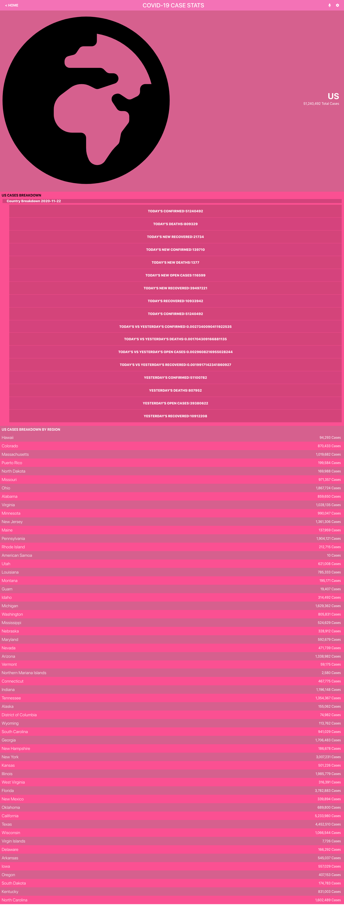
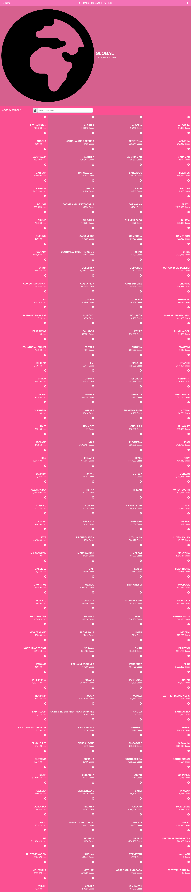

# React capstone project - Metrics webapp (Covid-19 STATS)

- This React capstone project is about building a mobile web application to check a list of metrics (numeric values) that you will create making use of React and Redux.

- I chose an API that provides numeric data about a Covid-19 Stats because it is currently a global concern .
  
- The webapp have several pages:
one page with a list of items that could be filtered by some parameters; like  country name. 
one page for the item details; the detail page of country case break down.





![Loom Video]:https://www.loom.com/share/711ff3c9b8364f81abb8e29975b837f2

![live link]:https://condescending-hawking-9179d0.netlify.app/


## Built With

- JSX, CSS,Tailwind CSS, JavaScript, React, react-router-dom, react-redux;
- Visual Studio, Git, & GitHub;

## Getting Started

To run this project, you only need a computer with a browser (like Google Chrome, Mozilla Firefox, Microsoft Edge, Apple Safari, etc.) installed, and follow these steps:

1. In your terminal, in the folder of your preference, type the following bash command to clone this repository:

```sh
git@github.com:fortuneonyeka/covid-19-data-dsplay.git
```

2. Now that you have already cloned the repo run the following commands to get the project up and running:
```sh
cd covid-19-data-dsplay
npm install
npm start
```

## Author

👤 **Ihedoro Fortunatus O**

- GitHub: [@fortuneonyeka](https://github.com/fortuneonyeka)
- Twitter: [@onyekafortune](https://twitter.com/onyekafortune)
- LinkedIn: [Ihedoro Fortunatus](https://www.linkedin.com/in/fortunatus-ihedoro/)

## 🤝 Contributing

Contributions, issues, and feature requests are welcome!

## Show your support

Give a ⭐️ if you like this project!

## Acknowledgments
- Original project design idea by [Nelson Sakwa on Behance.](https://www.behance.net/sakwadesignstudio) 🙌
- Hat tip to anyone whose code was used 🔰
- Inspiration 💘
- Microverse program ⚡
- Our standup team 🏹
- Family's support 🙌


## 📝 License

This project is [MIT](./LICENSE) licensed.